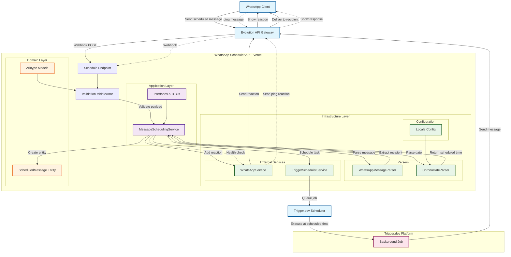

# WhatsApp Scheduler - Project Documentation

## Overview

This is a WhatsApp message scheduler built with TypeScript, Express.js, and Clean Architecture principles. The system allows users to send themselves WhatsApp messages with scheduling instructions, which are then parsed and scheduled for future delivery using Trigger.dev.

## Architecture

### System Overview



### Clean Architecture Implementation

The project follows Clean Architecture with clear separation of concerns:

```
├── domain/           # Enterprise business rules
│   ├── entities.ts   # Core business entities (ScheduledMessage)
│   └── models.ts     # Arktype validation schemas
├── application/      # Application business rules
│   ├── interfaces.ts # Service contracts and DTOs
│   └── services/     # Use cases and application services
├── infrastructure/   # External concerns (APIs, databases, frameworks)
│   ├── config/       # Configuration files
│   ├── middleware/   # Express middleware
│   ├── parsers/      # Message and date parsing
│   ├── schedulers/   # Task scheduling services
│   └── services/     # External service integrations
└── trigger/          # Trigger.dev background jobs
```

## Core Features

### 1. Message Scheduling
- In a chat with themselves, users reply to a contact with a message containing the text and scheduling instruction
- Format: Message text followed by a line starting with `> [when to send]`
- **How to use**:
  1. Find the contact you want to send a message to in WhatsApp
  2. Forward their contact card to yourself
  3. Reply to message containing the contact card
  4. Write your message followed by a scheduling line
  5. Example:
     ```
     Hello world! How are you doing?
     > tomorrow 3pm
     ```
  6. The system will:
     - Extract the recipient from the quoted contact's vCard
     - Parse the scheduling time from the line starting with `>`
     - Schedule the message for future delivery
     - React with ✅ if successful or ❌ if failed

### 2. Multi-Language Date Parsing
- Supports 9 languages: English, Portuguese, Spanish, French, German, Italian, Dutch, Japanese, Korean
- Uses chrono-node for natural language date parsing
- Timezone abbreviation support (BRT, CET, JST, etc.)
- Configurable via `CHRONO_LOCALE` environment variable

### 3. Ping Test Feature 
- Send `/ping` to yourself to test system health
- Returns 🏓 emoji reaction if all services are working
- Helps warm up serverless functions and verify connectivity
- Bypasses normal message validation for testing purposes

### 4. Security & Validation
- Only processes messages from users to themselves (`fromMe` validation)
- Arktype runtime validation for all incoming webhooks
- Environment-based configuration with required API keys

## Technical Components

### Domain Layer

#### Entities (`domain/entities.ts`)
- `ScheduledMessage`: Core business entity with validation
- Value objects with proper encapsulation
- Domain-driven design principles

#### Models (`domain/models.ts`)
- Arktype schemas for runtime validation
- WhatsApp webhook payload structure
- Type-safe message parsing

### Application Layer

#### Services (`application/services/MessageSchedulingService.ts`)
- Main orchestration service
- Handles webhook processing workflow
- Ping test logic with bypass for health checks
- Error handling and emoji reactions

#### Interfaces (`application/interfaces.ts`)
- Service contracts (IMessageParser, IWhatsAppService, ISchedulerService)
- Response DTOs with action types: `scheduled`, `ignored`, `error`, `ping`, `ping_failed`

### Infrastructure Layer

#### Message Parsing (`infrastructure/parsers/`)
- `ChronoDateParser`: Multi-locale date parsing with timezone support
- `WhatsAppMessageParser`: Extracts recipient, message, and schedule from WhatsApp text

#### External Services (`infrastructure/services/`)
- `WhatsAppService`: Evolution API integration for sending messages and reactions
- `TriggerSchedulerService`: Trigger.dev integration for background job scheduling

#### Configuration (`infrastructure/config/`)
- `locales.ts`: Multi-language parser configuration
- Timezone abbreviation mappings (BRT, CET, JST, etc.)

## Key Dependencies

### Runtime Dependencies
- **Express.js**: Web framework and API endpoints
- **chrono-node v2.8.3**: Natural language date parsing with multi-locale support
- **@trigger.dev/sdk v3**: Background task scheduling with wait.for() functionality
- **arktype**: Runtime type validation and schema definition
- **axios**: HTTP client for Evolution API communication
- **dotenv**: Environment variable management

### Development Dependencies
- **TypeScript**: Type safety and development experience
- **esbuild**: Fast bundling and optimization (reduces bundle from 1.7MB to 152KB)
- **Vercel**: Serverless deployment platform

## API Endpoints

### POST /schedule
- Webhook endpoint for WhatsApp messages
- Validates payload with arktype schemas
- Returns full response object with action and message properties
- Handles ping tests and message scheduling

### GET /
- Health check endpoint
- Returns `{"status": "ok"}`

## Environment Variables

### Required
- `EVOLUTION_API_URL`: Evolution API base URL for WhatsApp integration
- `EVOLUTION_API_KEY`: Authentication key for Evolution API
- `TRIGGER_SECRET_KEY`: Trigger.dev API key for task scheduling

### Optional
- `CHRONO_LOCALE`: Language for date parsing (default: 'en')
- `DEFAULT_TIMEZONE`: Timezone for date parsing (default: 'America/Sao_Paulo')

## Deployment

### Vercel Configuration (`vercel.json`)
- Serverless function deployment
- API routing configuration
- Environment variable management

### Build Process (`build.mjs`)
- esbuild bundling for optimization
- Separate bundles for main API and Trigger.dev functions
- 91% bundle size reduction (1.7MB → 152KB)

## Development Workflow

### Local Development
```bash
npm run build          # Build optimized bundles
npm start             # Start Vercel dev server
npm run test:ping     # Test ping functionality on production
npm run test:ping:local # Test ping functionality locally
```

### Deployment
```bash
npm run deploy        # Deploy both Trigger.dev and Vercel
npm run deploy:vercel # Deploy only to Vercel
npm run deploy:trigger # Deploy only Trigger.dev functions
```

## Testing & Debugging

### Ping Test Scripts
- `scripts/test-ping.js`: Production ping testing
- `scripts/test-ping-local.js`: Local development testing
- Both scripts send realistic WhatsApp webhook payloads

### Logging Strategy
- Comprehensive debug logging in services
- Evolution API request/response logging
- Payload validation and processing logs
- Error tracking with emoji reactions

## Message Processing Flow

1. **Webhook Reception**: WhatsApp sends webhook to `/schedule` endpoint
2. **Validation**: Arktype validates incoming payload structure
3. **Security Check**: Verify message is from user to themselves
4. **Ping Detection**: Check for `/ping` message (bypass normal flow)
5. **Message Structure Validation**: 
   - Must be a conversation message type
   - Must have quoted contact message (contains recipient vCard)
   - Must contain scheduling line starting with `>`
6. **Message Parsing**: 
   - Extract recipient phone number from quoted contact's vCard (`waid` field)
   - Extract message text (everything except the `> time` line)
   - Extract scheduling time from line starting with `>`
7. **Date Parsing**: Use chrono-node with configured locale to parse natural language time
8. **Schedule Creation**: Create domain entity with validation
9. **Task Scheduling**: Queue background job with Trigger.dev
10. **Feedback**: Add emoji reaction (✅ success, ❌ error, 🏓 ping)

## Error Handling

### Graceful Degradation
- Failed reactions don't prevent message scheduling
- Comprehensive error logging for debugging
- Proper HTTP status codes and error responses

### Monitoring
- Evolution API connection status via ping tests
- Trigger.dev task scheduling verification
- Bundle size and performance tracking

## Future Considerations

### Scalability
- Clean Architecture supports easy feature additions
- Dependency injection enables testing and mocking
- Separate concerns allow independent scaling

### Maintenance
- Type safety prevents runtime errors
- Comprehensive logging aids debugging
- Documentation enables knowledge transfer

## Troubleshooting

### Common Issues
1. **P1001 Database Errors**: Evolution API connection issues (use ping test to verify)
2. **Message Ignored**: Check `fromMe` validation and payload structure
3. **Date Parsing Failures**: Verify locale configuration and timezone settings
4. **Bundle Size**: Use esbuild optimization and external dependencies

### Debug Commands
```bash
# Check Evolution API connectivity
npm run test:ping

# Local development with real-time logs
npm start

# Bundle analysis
npm run build  # Shows bundle sizes
```

This documentation serves as both project context and troubleshooting guide for future development and maintenance.